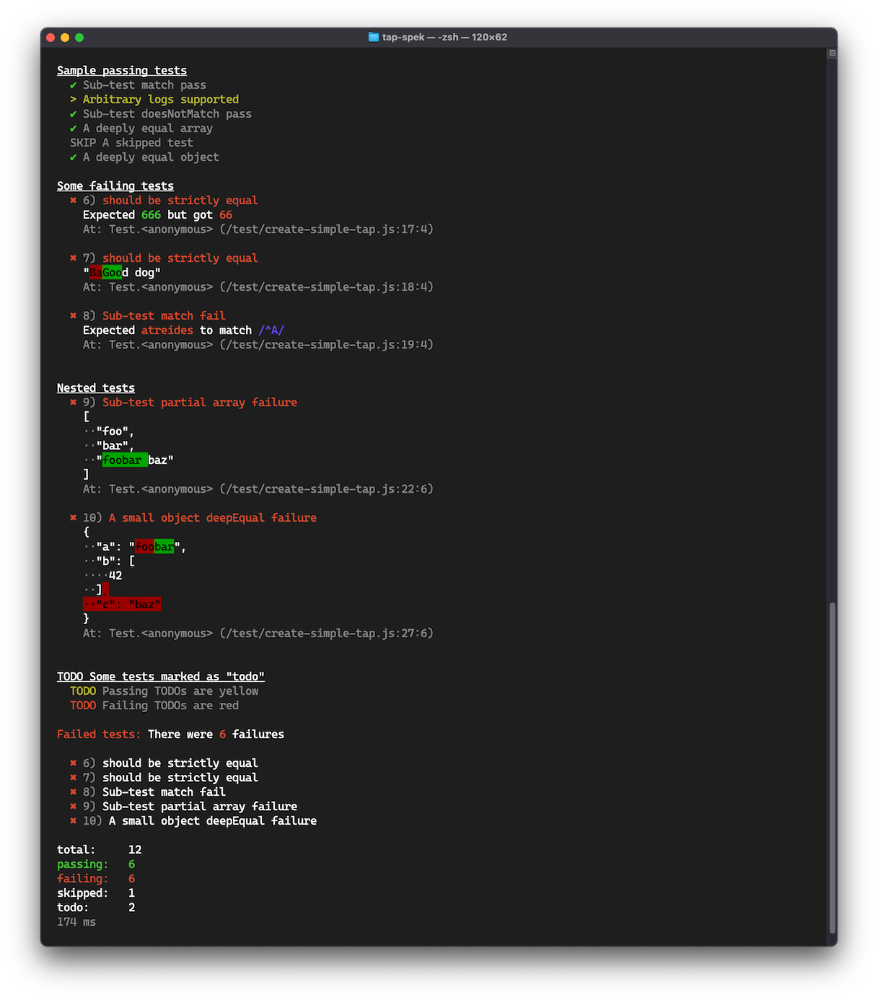

<h1 align="center"><code>tap-arc</code> 📋</h1>

<p align="center">
  A small <a href="https://testanything.org/">TAP</a> reporter with spec-like output, streaming, and failure diffing.<br>
  <a href="https://www.npmjs.com/package/tap-arc"><strong><code>tap-arc</code> on npmjs.org »</strong></a><br>
  <br>
  Contents:
  <a href="#Installation-and-usage">Install</a>
  •
  <a href="#Development">Development</a>
  •
  <a href="#FAQ">FAQ</a>
</p>

## Objectives

- minimal, informative spec-like output for all assertions
- minimal, maintained dependencies
- streaming in and out
- helpful diffing for failures



## Installation and Usage

Compatible with Node.js v16+ -- v14 also works but is ***not*** recommended.

Save `tap-arc` as a development dependency:

```sh
npm i -D tap-arc
```

Simply pipe tap output to `tap-arc`.  
Example `npm test` script:

```js
// package.json
"scripts": {
  "test": "tape test/**/*.js | tap-arc"
}
```

💁  `tap-arc` will format output from any tap reporter. [`tape`](https://github.com/ljharb/tape) is our favorite and was used for testing.

### `tap-arc --help`

```
Usage:
  tap-arc <options>

Parses TAP data from stdin, and outputs a "spec-like" formatted result.

Options:

  -v | --verbose
    Output full stack trace, TAP version, and plan

  -p | --pessimistic | --bail
    Immediately exit upon encountering a failure
    example: tap-arc -p

  --no-diff
    Do not show diff for failed assertions
    example: tap-arc --no-diff

  --no-color
    Output without ANSI escape sequences for colors
    example: tap-arc --no-color

  --fail-bad-count
    Fail when the number of assertions parsed does not match the plan
    example: tap-arc --fail-bad-count
```

## Development

When building `tap-arc`, it's helpful to try various TAP outputs. See `package.json` `"scripts"` for useful "tap-arc.*" commands to test passing and failing TAP.

```sh
npm run tap-arc.simple # used to create the screen shot above
```

### Dev Tips

1. To see previous exit code, run:

```sh
echo $?
```

### Testing

Primarily, `tap-arc` is tested to output the correct exit code based on your test suite's TAP output.

Testing could be improved by unit testing the printer and diff maker.

## FAQ

<details>
<summary>"Expected <code>n</code> tests, but found <code>< n</code>"</summary>

_What happened?_  
✅ The TAP parser found zero failing tests  
✅ The final tally from the raw TAP shows `n` of `n` passed  
🤨 But the TAP plan called for more tests than were found, counted, and parsed.

💁‍♀️ Currently, when this case is detected, `tap-arc` will exit with a successful status code.  
This can be overridden with the `--fail-bad-count` flag.

_Why, though_?  
This has been observed specifically on Windows, where the TAP output is buffered to another stream and not piped to `tap-arc`.  
Libraries like `mock-fs` tinker with stdout and subsequent TAP output is lost. Try closing those helpers before making an assertion that generates TAP.

</details>

<details>
<summary>"0 tests found" fails the suite?</summary>

Yes. At least one passing test is required to pass the suite.  
This helps ensures there wasn't a silent, catastrophic failure in the test suite.

</details>

<details>
<summary>Why does <code>tap-arc</code> get to decide these things?</summary>

`tap-arc` is responsible for the test suite's exit code. If your entire CI stack is piped to a reporter, it's an important job. So `tap-arc` is a bit skeptical by default to help ensure your suite is passing.

If you'd like to see different behavior from `tap-arc`, please open an issue or PR. We'd love to hear your use case.

</details>

## Credit & Inspiration

- [tap-spec](https://github.com/scottcorgan/tap-spec) ol' reliable, but a bit stale and vulnerable
- [tap-difflet](https://github.com/namuol/tap-difflet) inspired output and diffing, also vulnerable
- [tap-min](https://github.com/derhuerst/tap-min) helpful approaches to streaming and exit codes, used to report `tap-arc`'s TAP
