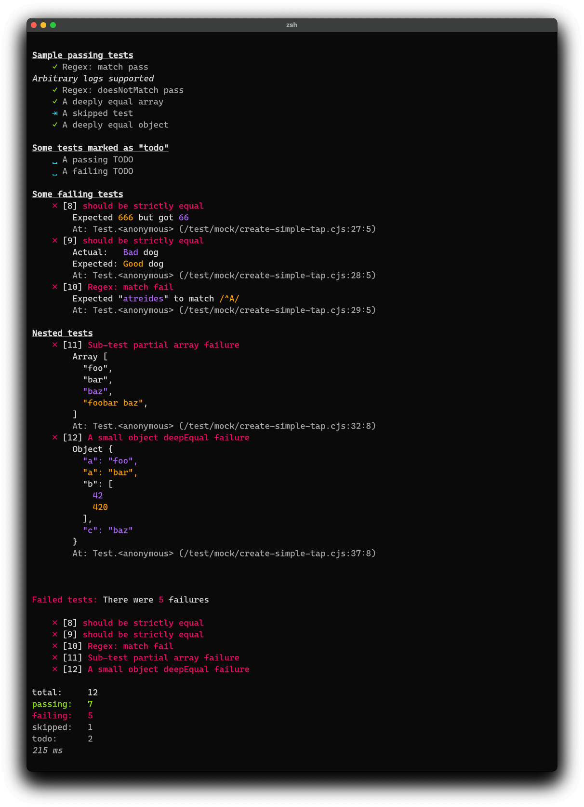

# `tap-spek`

> A small (<10kB) [TAP](https://testanything.org/) reporter with spec-like output, streaming, and failure diffing.

## Objectives

- minimal, informative spec-like output for all assertions
- minimal, maintained dependencies -- can't be shipping React to CI
- streaming in and out
- helpful diffing for failures



## Installation & Usage

For a JavaScript project, save `tap-spek` as a development dependency:

```sh
npm i -D tap-spek
```

Simply pipe tap output to `tap-spek`.  
Example `npm test` script:

```js
// package.json
"scripts": {
  "test": "tape test/**/*.js | tap-spek"
}
```

> 💁  `tap-spek` will format output from any tap reporter. [`tape`](https://github.com/substack/tape) was used for testing.

## Development

The bulk of the lib lives in `./index.js`.  
`./bin/tap-spek` pipes stdin (from a TAP reporter) to `tap-spek` and then to stdout. The bin also handles exit code for a failing run.

When building `tap-spek`, it's helpful to try various TAP outputs. See `package.json` `"scripts"` for useful "spek:*" commands to test passing and failing TAP.

```sh
npm run spek:simple # used to create the screen shot above
```

The main library is snapshot tested (`npm test` loads all snapshots to compare to current output). Create snapshots with the "snap:*" commands.

## TODO & Improvements

> These should be moved to the issue tracker

- [x] TAP kitchen sink (specialized output for each operator)
- [ ] improved object diffing
- [ ] group failure summary by comment (currently just a list of names)
- [ ] improve nested test output (indented sub-tests)
- [x] test tap-spek with snapshot tests
- [ ] combined support for ESM and CommonJS
- [x] remove `duplexer3` dep
- [ ] options
  - [ ] print stacktrace
  - [ ] no colors
  - [ ] pessimistic
  - others?

## Credit & Inspiration

- [tap-spec](https://github.com/scottcorgan/tap-spec) ol' reliable, but a bit stale and npm vulnerabilities
- [tap-difflet](https://github.com/namuol/tap-difflet) inspired output and diffing, also vulnerable
- [tap-min](https://github.com/derhuerst/tap-min) helpful approaches to streaming and exit codes
